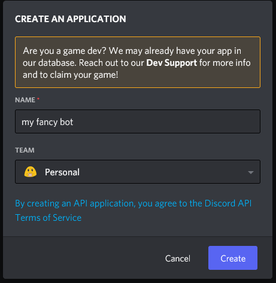
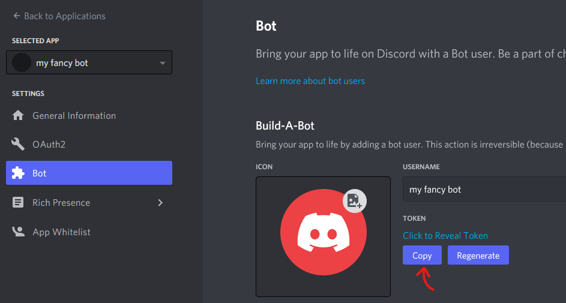
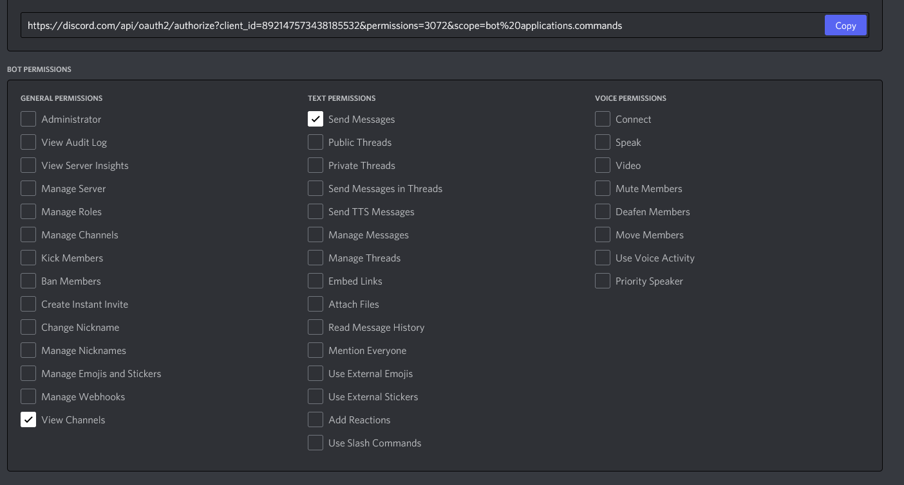
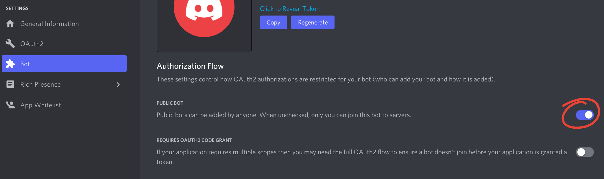

### Creating a bot account

To get started with nyxx, you'll need a Discord bot account!

- Head to the [Discord developers](https://discord.com/developers) site.
  You'll be prompted to login if you aren't already.
- Once you are signed in, you should be redirected to the [applications](https://discord.com/developers/applications) page.
- Look towards to the top right and click the **New Application** button.

 

- Type in a name for the application, this will be the initial name of your bot account. Then click **Done**. 
- On the left menu, select the **Bot** tab, then look to the right and click the **Add Bot** button. 
- You will be presented with a menu asking if you _really_ want to add a bot, which we do so click **Yes, do it!**

### Getting your bot's token

_WARNING: Do NOT share or publish this token anywhere publically. If you do, anyone will be able to use your bot account to perform any bot actions - such as banning users and leaving guilds._

- Once your bot account is made, on that same **Bot** tab, there will be a section labeled **Token**.
- For utilizing the token within nyxx, press the **Copy** button and paste it into your code where the token is stored, or any other place you may store it. 
- In the event you share your token, be sure to press the **Regenerate** button so the old token can't be used anymore.

### Inviting your bot to a server

Now that we've gotten this far, it's probably important that we invite the bot to your server to actually test commands in!

- First, head to the **OAuth2** tab found in the left menu on your bot's application page.
- Then scroll down to the OAuth2 URL Generator and select the **bot** checkbox under the **scopes** section. If you wish to use slash commands as well, check the **application.commands** scope. 
- Scroll down some more so you can see the **Bot Permissions** section. This is where you get to select which permissions your bot has when it joins a server. For basic usage, select the **View Channels and Send Messages** permissions, and then scroll up to the generated URL and click the **Copy** button on the right. 
- Finally, head to that URL in your browser and add your bot!

### Making your bot public (or private)

- Head to the **Bot** tab found in the left menu on your bot's application page.
- Under the **Authorization Flow** section, find the **Public Bot** toggle. 
- To make your bot public so anyone can add it to their server, change the toggle to the right (so it's blurple); and do the inverse to make it private so only you can add the bot to servers. By default your bot should be public.

### Privileged Gateway Intents

Gateway intents make it so your bot can only recieve specific intents to lower the processing power necessary for the bot. Some of these intents are limited since they can contain potentially more sensitive data.

These include:

- **Presence Intent**: This toggle will enable you to recieve events when someone's presence or info is updated. This includes their status, username changes, avatar changes, as well as other similar info.
- **Server Members Intent**: This toggle will enable you to recieve events when guild members join and leave the server, when members are updated, who was added to and removed from a thread, and the ability to list guild members.

To toggle these intents:

- Head to the **Bot** tab found in the left menu on your bot's application page.
- Find the **Privileged Gateway Intents** section. 
- Toggle the intents as necessary for your bot.
