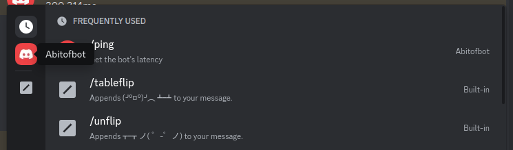
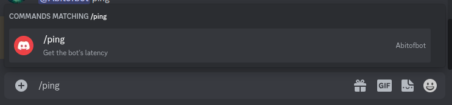
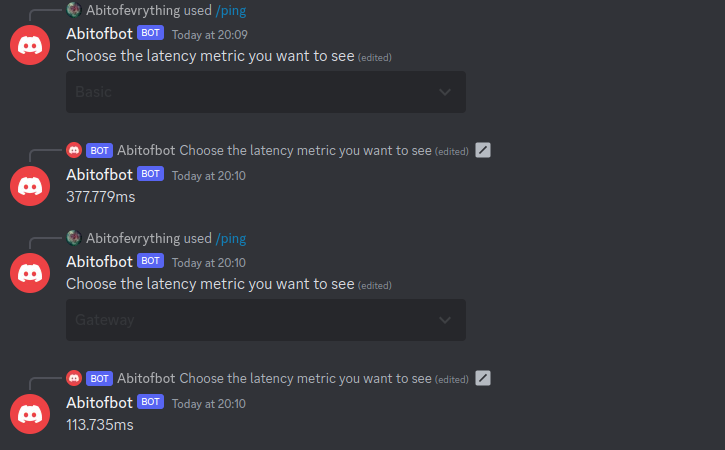
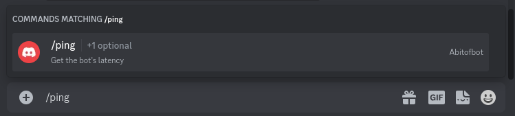
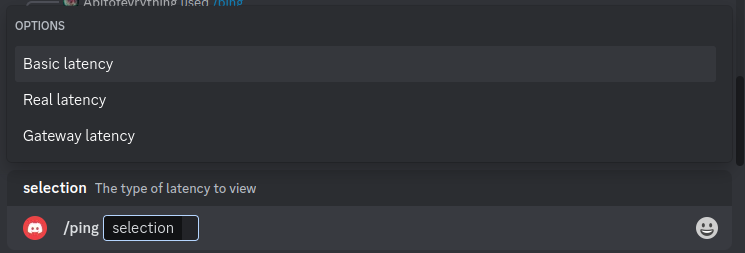
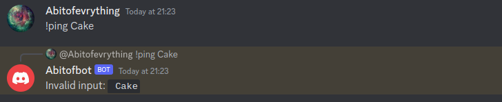

`nyxx_commands` is a command framework maintained by the nyxx devs for use in bots using nyxx. It
provides a way to create commands without messing around with argument parsing or handling command
interactions, and provides an interface for chaining multiple interactions together in the same
callback, allowing for commands to have multiple "steps".

In this tutorial, we'll implement a slightly overengineered `ping` command which displays various
latency statistics about the bot.

This guide assumes you know how to create a basic bot with nyxx. If you don't, check out
[Writing your first bot](writing_your_first_bot.mdx) before continuing.

## Installing nyxx_commands

`nyxx_commands` is a separate package to `nyxx`, so we'll first need to add it to our project:
running `dart pub add nyxx_commands` will add nyxx_commands to our project. We'll also be using
`nyxx` to create our client, so make sure both packages are installed.

## Creating a simple command

For now, we'll make a simple ping command that always responds with the client's HTTP latency,
accessible as `client.httpHandler.latency`.

Here's the code to do that:
```dart
// Imports will be ommitted in code samples below
import 'package:nyxx/nyxx.dart';
import 'package:nyxx_commands/nyxx_commands.dart';

final ping = ChatCommand(
  'ping',
  "Get the bot's latency",
  (ChatContext context) async {
    // ...
  },
);
```

To create a command in nyxx_commands, we create an instance of one of the three command classes:
 - `ChatCommand`s are commands that are run by pressing `/` and choosing the command in a text
   channel, or by using the bot's prefix with the command name. These are the most common.
 - `UserCommand`s are commands that can be run by right clicking on a user in Discord.
 - `MessageCommand`s are commands that can be run by right clicking on a message in Discord.

The `ChatCommand` constructor we're calling takes three arguments:
 1. The name of the command (`ping`). This name has certain restrictions, using lowercase letters
    and dashes or underscores for spacing works well.
 2. A description for the command. This is shown in the command selection menu that appears when
    pressing `/` in a text channel.
 3. The function to be called when someone runs our command, which we haven't completed yet.

:::caution
You might notice that the command callback specifies the type of `context` instead of leaving it
blank and letting Dart infer it. You can omit the types of arguments when using `UserCommand`s or
`MessageCommand`s, but they are **required** when using `ChatCommand`.

This is because the type of the callback is `Function` and does not specify the types of any of the
arguments to support argument parsing (which we'll see later in the tutorial).
:::

We can access the client from the context using `context.client` to calculate the latency in our
command:
```dart
final ping = ChatCommand(
  'ping',
  "Get the bot's latency",
  (ChatContext context) async {
    final latency = context.client.httpHandler.latency;
    final formattedLatency =
        (latency.inMicroseconds / Duration.microsecondsPerMillisecond).toStringAsFixed(3);

    // ...
  },
);
```

Finally, to respond to the user running the command, we use the `context.respond` method:
```dart
final ping = ChatCommand(
  'ping',
  "Get the bot's latency",
  (ChatContext context) async {
    final latency = context.client.httpHandler.latency;
    final formattedLatency =
        (latency.inMicroseconds / Duration.microsecondsPerMillisecond).toStringAsFixed(3);

    await context.respond(MessageBuilder(content: '${formattedLatency}ms'));
  },
);
```

## Adding our command to a client

Now that we've created our command, we need to add it to a client so that it will be registered with
Discord and will run our function when the command is executed.

First, we create a `CommandsPlugin` that we will register our command to:
```dart
// ... command code here ...

void main() async {
  final commands = CommandsPlugin(prefix: mentionOr((_) => '!'));
}
```

The `CommandsPlugin` constructor allows you to configure some of the behavior of nyxx_commands.
Here, we provide a `prefix` so that users can also run our command using text messages: either a
mention of the client's user or the string `!` will count as a prefix.

Next, we'll create a client using that plugin:
```dart
// ...

void main() async {
  final commands = CommandsPlugin(prefix: mentionOr((_) => '!'));

  await Nyxx.connectGateway(
    'TOKEN',
    GatewayIntents.allUnprivileged | GatewayIntents.messageContent,
    options: GatewayClientOptions(plugins: [logging, cliIntegration, commands]),
  );
}
```

Because we want our users to be able to use text messages to run commands, we'll need to request the
message content intent. This is a privileged intent and will need to be enabled in Discord's
application page, which you can find out how to do [here](creating_a_bot_account#privileged-gateway-intents).

Finally, we register our command to the plugin:
```dart
// ...

void main() async {
  final commands = CommandsPlugin(prefix: mentionOr((_) => '!'));

  commands.addCommand(ping);

  await Nyxx.connectGateway(
    'TOKEN',
    GatewayIntents.allUnprivileged | GatewayIntents.messageContent,
    options: GatewayClientOptions(plugins: [logging, cliIntegration, commands]),
  );
}
```

And we're good to go!

## Testing our command

We now have a fully functional bot with a ping command. Making sure to replace the `TOKEN` with your
bot's actual token, you can run the program and test the command. You should see a line indicating
the command was registered in the logs:
```
[2023-09-30 18:47:54.654105] [INFO] [Commands] Synced 1 commands to Discord
```

Go to a text channel the bot is in and press the `/` key. The command menu should appear and your
bot should appear in the sidebar. You might have to reload your Discord client to get it to appear.



Typing in `/ping` will show us the command we just created...



...and we can press enter to execute it, after which our bot will respond with its latency.


We can also run our command using the prefixes we defined by sending a message to the channel.


## Using a selection menu

:::info
From here on out, we'll be omitting the `main()` function from the code samples, as well as the
imports. We'll show them if they needs changing.
:::

nyxx includes two other latency measurements for the different parts of the API:
`client.httpHandler.realLatency` provides the actual network latency and `client.gateway.latency`
provides the latency on the Gateway connection. Let's enhance our ping command to let users select
which latency metric they want to see.

For this, we need to let users of our command choose between multiple different options.
nyxx_commands provides a way to do this using `context.getSelection`. In our case, we'll choose one
of the three strings `Basic` (normal http latency), `Real` (real network latency) or `Gateway`
(Gateway latency).

Let's remove the code from the `ping` command callback and add the selection:
```dart
final ping = ChatCommand(
  'ping',
  "Get the bot's latency",
  (ChatContext context) async {
    final selection = await context.getSelection(
      ['Basic', 'Real', 'Gateway'],
      MessageBuilder(content: 'Choose the latency metric you want to see'),
    );

    // ...
  },
);
```

Next, we fetch the latency value for the selection, and we add back our response code to send the
latency to the user:
```dart
final ping = ChatCommand(
  'ping',
  "Get the bot's latency",
  (ChatContext context) async {
    final selection = await context.getSelection(
      ['Basic', 'Real', 'Gateway'],
      MessageBuilder(content: 'Choose the latency metric you want to see'),
    );

    final latency = switch (selection) {
      'Basic' => context.client.httpHandler.latency,
      'Real' => context.client.httpHandler.realLatency,
      'Gateway' => context.client.gateway.latency,
      _ => throw StateError('Unexpected selection $selection'),
    };

    final formattedLatency =
        (latency.inMicroseconds / Duration.microsecondsPerMillisecond).toStringAsFixed(3);

    await context.respond(MessageBuilder(content: '${formattedLatency}ms'));
  },
);
```

When we restart the bot and run the command, we can see it now prompts us to select a latency
metric.


Selecting different metrics gives us different latency values.



## Using arguments

Using selection menus is powerful and looks nice in the Discord UI, but it _is_ slow. Let's add
arguments to our command so power users can specify which metric they want to see before the command
is even executed.

To do this, we simply add an argument to our function:
```dart
final ping = ChatCommand(
  'ping',
  "Get the bot's latency",
  (ChatContext context, [String? selection]) async {
    selection ??= await context.getSelection<String>(
      ['Basic', 'Real', 'Gateway'],
      MessageBuilder(content: 'Choose the latency metric you want to see'),
    );

    // ...
  },
);
```

:::caution
By making our argument nullable, `getSelection` is now looking for a selection of type `String?`. We
want a `String`, so we have to specify the type argument explicitly.
:::

By making the type of the argument `String`, nyxx_commands will convert the user's input to a
`String` for us to use in our function. This isn't particularily useful, but it also works for other
types such as `int` and even some types from nyxx like `User`. The argument is also optional so that
users can omit it when running the command.

Now, when we restart the bot and open the command menu we can see that the command has an optional
argument (you might have to restart your client again or wait a few minutes for the command to
update).



If we execute the command and set the `selection` argument to `Real`, we get the bot's real latency,
without opening the selection menu.


Since the argument is optional, we can also omit it, in which case the selection menu will be used
instead.

## Using argument annotations

One problem with this method is what happens when the user passes an invalid argument, such as
`Cake`. Trying to get the client's cake latency will of course not work since the developers ate it
all. Instead, we get an error:
```
[2023-09-30 20:30:35.221988] [SHOUT] [Commands] Uncaught exception in command
Error: Command Exception: Bad state: Unexpected selection Cake
Stack trace:
#0      ping.<anonymous closure> (file:///home/abitofevrything/Programming/nyxx/nyxx_docs/test.dart:17:12)
#1      Function._apply (dart:core-patch/function_patch.dart:11:71)
#2      Function.apply (dart:core-patch/function_patch.dart:35:12)
#3      ChatCommand.invoke (package:nyxx_commands/src/commands/chat_command.dart:432:22)
<asynchronous suspension>
#4      EventManager.processInteractionCommand (package:nyxx_commands/src/event_manager.dart:197:5)
<asynchronous suspension>
#5      CommandsPlugin.afterConnect.<anonymous closure> (package:nyxx_commands/src/commands.dart:227:13)
<asynchronous suspension>
```

This isn't great, since the user who ran the command is left with a loading screen that will
eventually (after 15 minutes) turn into an error message. Fortunately, nyxx_commands provides a way
for developers to let users know what options are available for an argument, by using the `@Choices`
annotation on the argument:
```dart
final ping = ChatCommand(
  'ping',
  "Get the bot's latency",
  (
    ChatContext context, [
    @Choices({
      'Basic latency': 'Basic',
      'Real latency': 'Real',
      'Gateway latency': 'Gateway',
    })
    String? selection,
  ]) async {
    // ...
  },
);
```

The `@Choices` annotation takes a map where the keys are the text displayed in the UI and the values
are what is actually passed to the command callback. In this case, we make it clear we are referring
to latencies, while preserving the same values we send to our function.

:::caution
Discord enforces a maxmimum of 15 choices per argument.
:::

We can also use the `@Description` annotation to provide a description for our argument, which you
might have noticed was missing earlier:
```dart
final ping = ChatCommand(
  'ping',
  "Get the bot's latency",
  (
    ChatContext context, [
    @Choices({
      'Basic latency': 'Basic',
      'Real latency': 'Real',
      'Gateway latency': 'Gateway',
    })
    @Description('The type of latency to view')
    String? selection,
  ]) async {
    // ...
  },
);
```

Now, when we restart our bot, restart our client and open the command menu (you get the drill now),
we can see our command has set choices in the UI:



## Using converters

We can still do better than choices. If a user runs our command using a text message and provides
an invalid argument (e.g `!ping Cake`), they can bypass our choices and still cause the same error.

The way to make your command reject invalid input is to use converters. Converters take the input
from Discord and transform it into the type your command wants - like `String` in this case.
`stringConverter` is the simplest converter, just returning its input, but nyxx_commands comes with
a few built in converters for types like `int`, `bool` or `User` (and more!)

We need to create our own converter that only accepts the strings `Basic`, `Real`, or `Gateway`.
There are many ways to create converters, but the simplest is to use `SimpleConverter`:
```dart
String latencyTypeToString(String type) => type;

const latencyTypeConverter = SimpleConverter.fixed(
  elements: ['Basic', 'Real', 'Gateway'],
  stringify: latencyTypeToString,
);

// ...
```

:::info
We need to provide a function to transform our values to a string to be shown in the UI and used for
conversion. Since our values are already strings, `latencyTypeToString` just returns the input.
However, if you are making a converter for a different type, you'll need to tell nyxx_commands how
to convert your type to a `String`.
:::

:::info
Our converter needs to be `const` so it can be used in the `@UseConverter` annotation. This is why
`latencyTypeToString` is declared as its own function instead of using a function literal in the
`SimpleConverter.fixed` constructor, as function literals are not `const` but top-level functions
are.

The `const` requirement also applies to the `elements` you provide to the converter. If the type the
converter is for isn't `const`, use the default `SimpleConverter` constructor instead, which will
call a function to get its elements.
:::

Once we've created our converter, we can replace our `@Choices` annotation with an `@UseConverter`
annotation:
```dart
final ping = ChatCommand(
  'ping',
  "Get the bot's latency",
  (
    ChatContext context, [
    @UseConverter(latencyTypeConverter)
    @Description('The type of latency to view')
    String? selection,
  ]) async {
    // ...
  },
);
```

Now, if we run our command with an invalid argument, we still get an error. However, the error is
different this time:
```
[2023-09-30 21:12:59.460172] [SHOUT] [Commands] Uncaught exception in command
Error: Command Exception: Could not parse input StringView[index=0 (current=" "), end=5, buffer=" Cake"] to type "CommandOptionType(3)"
Stack trace:
#0      Logger.log (package:logging/src/logger.dart:222:33)
#1      ...
```

The error thrown now is a `ConverterFailedException`, and this is the error thrown by all converters
when the input is invalid. This means we can handle all cases of invalid input in one place, instead
of handling each case individually (e.g by catching the `StateError` we threw earlier).

To do this, we listen to the `onCommandError` stream and disable the automatic logging of errors (
we'll log them ourselves from now on) in our `main()` function:
```dart
// ...

void main() async {
  final commands = CommandsPlugin(
    prefix: mentionOr((_) => '!'),
    options: CommandsOptions(logErrors: false),
  );

  commands.addCommand(ping);

  commands.onCommandError.listen((error) async {
    if (error is ConverterFailedException) {
      // ConverterFailedException can be thrown during autocompletion, in which case we can't
      // respond with an error. This check makes sure we can respond.
      if (error.context case InteractiveContext context) {
        await context.respond(MessageBuilder(
          content: 'Invalid input: `${error.input.remaining}`',
        ));
      }
    } else {
      print('Uncaught error: $error');
    }
  });

  await Nyxx.connectGateway(
    'MTAzMzY4MTg0MzcwODUxMDIzOA.Ge6Ifj.aACf7ZJmeE9b-bzItdufotxv66qCvs2ACbcSdg',
    GatewayIntents.allUnprivileged | GatewayIntents.messageContent,
    options: GatewayClientOptions(plugins: [logging, cliIntegration, commands]),
  );
}
```

Now, if we try to provide an invalid input, we can see our bot handles it graciously.



Converters have several other benefits that aren't immediately obvious here, including adding the
ability to use autocompletion for arguments and allowing custom types to be used in command arguments
and functions like `context.getSelection`.

:::info
If you create a converter for your own type, instead of using `@UseConverter`, you can add it to
your `CommandsPlugin` instance using `CommandsPlugin.registerConverter`.

This will make anywhere in your code that uses your type with nyxx_commands use that converter,
and can also be used to make non-const converters. However, if you call `registerConverter` with a
converter for a common type like `String`, all occurences of `String` will use that converter. Not
good in this case, as we don't want to limit every string to be one of `Basic`, `Real` or `Gateway`.
:::

We've now covered all the basic components of nyxx_commands. Join us at
[our Discord server](https://discord.gg/nyxx) or read the
[API documentation](https://pub.dev/documentation/nyxx_commands) if you want to find out more.

Here's the complete code for our bot, in case you lost track along the way:
```dart
import 'package:nyxx/nyxx.dart';
import 'package:nyxx_commands/nyxx_commands.dart';

final ping = ChatCommand(
  'ping',
  "Get the bot's latency",
  (
    ChatContext context, [
    @UseConverter(latencyTypeConverter)
    @Description('The type of latency to view')
    String? selection,
  ]) async {
    selection ??= await context.getSelection<String>(
      ['Basic', 'Real', 'Gateway'],
      MessageBuilder(content: 'Choose the latency metric you want to see'),
    );

    final latency = switch (selection) {
      'Basic' => context.client.httpHandler.latency,
      'Real' => context.client.httpHandler.realLatency,
      'Gateway' => context.client.gateway.latency,
      _ => throw StateError('Unexpected selection $selection'),
    };

    final formattedLatency =
        (latency.inMicroseconds / Duration.microsecondsPerMillisecond).toStringAsFixed(3);

    await context.respond(MessageBuilder(content: '${formattedLatency}ms'));
  },
);

void main() async {
  final commands = CommandsPlugin(
    prefix: mentionOr((_) => '!'),
    options: CommandsOptions(logErrors: false),
  );

  commands.addCommand(ping);

  commands.onCommandError.listen((error) async {
    if (error is ConverterFailedException) {
      // ConverterFailedException can be thrown during autocompletion, in which case we can't
      // respond with an error. This check makes sure we can respond.
      if (error.context case InteractiveContext context) {
        await context.respond(MessageBuilder(
          content: 'Invalid input: `${error.input.remaining}`',
        ));
      }
    } else {
      print('Uncaught error: $error');
    }
  });

  await Nyxx.connectGateway(
    'MTAzMzY4MTg0MzcwODUxMDIzOA.Ge6Ifj.aACf7ZJmeE9b-bzItdufotxv66qCvs2ACbcSdg',
    GatewayIntents.allUnprivileged | GatewayIntents.messageContent,
    options: GatewayClientOptions(plugins: [logging, cliIntegration, commands]),
  );
}
```

Happy coding!
